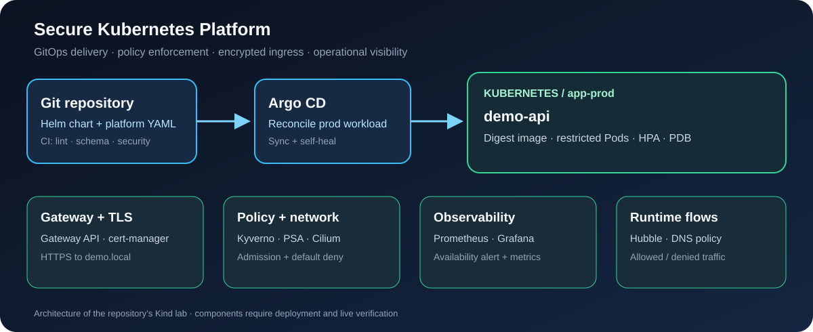

# Secure Kubernetes Platform

 

A reproducible Kubernetes lab covering GitOps delivery, workload isolation, admission policy, TLS, scaling, and operational visibility. The example workload is deliberately small so the platform controls remain the focus.



## What it demonstrates

| Area | Implementation | Evidence |
|---|---|---|
| Delivery | Argo CD syncs a Helm workload from Git; Kustomize manages platform resources | Application health, sync status and drift correction |
| Admission | Restricted Pod Security Admission and Kyverno CEL policies | Rejection of an unpinned or unbounded Pod |
| Networking | Cilium, default-deny policies, explicit DNS and Gateway traffic | Allowed/denied flows and Hubble |
| TLS | cert-manager issues a self-signed lab certificate for a Gateway API HTTPS listener | `Certificate` Ready and an HTTPS response |
| Availability | Multiple replicas, HPA, PDB, Metrics Server and a Prometheus availability alert | Metrics, replica count and alert state |
| CI | Chart rendering, kubeconform, Checkov, Trivy and separate Kind E2E workflow | Workflow run logs |

## Requirements

Linux with Docker, `kind`, `kubectl`, and Helm 3; the Kind cluster has one control plane and two workers. Bootstrap requires access to the chart, image and CRD registries and a reachable GitHub repository URL for Argo CD. Review the pinned versions and local resource use before running.

## Deploy

```bash
make cluster
REPO_URL=https://github.com/abdelkader-benaissi/secure-kubernetes-platform.git make bootstrap
make validate
kubectl -n platform-system get application secure-platform-prod
kubectl -n app-prod get deployment,pods,hpa,pdb,certificate,gateway,httproute
```

Bootstrap installs Gateway API CRDs, Cilium/Hubble, cert-manager, Kyverno, Metrics Server, Prometheus/Grafana, and Argo CD. It applies `platform/base`, then registers the Helm application. `REPO_URL` is substituted at bootstrap time.

For an HTTPS check after Gateway programming, resolve `demo.local` to the Gateway address and trust the self-signed certificate for this lab. See the [threat model](docs/THREAT-MODEL.md) for control boundaries.

## Validate and capture evidence

```bash
make validate
kubectl -n platform-system get application secure-platform-prod \
  -o jsonpath='{.status.sync.status}{" "}{.status.health.status}{"\n"}'
kubectl -n app-prod get certificate demo-api-tls
make evidence
```

The validation script renders dev and prod Helm configurations plus the Kustomize platform layer. The E2E workflow also checks reconciliation and an admission denial on fresh Kind. `evidence/` is ignored because cluster output can contain environment-specific details; review before sharing.

## Repository map

| Path | Purpose |
|---|---|
| `charts/demo-api/` | Non-root, digest-pinned workload with probes, HPA and PDB |
| `environments/` | Dev and prod Helm values for local rendering |
| `platform/base/` | Namespaces, policies, certificate, Gateway and alert |
| `gitops/root.yaml` | Argo CD Application definition |
| `scripts/`, `docs/` | Bootstrap, checks, evidence, architecture and threat model |

## Scope

This is a Kind lab. The self-signed issuer, lab Grafana credential and single-host cluster are not production choices. External secret management, persistent monitoring, multi-zone availability and off-cluster backups are out of scope. A CI run is required before claiming successful deployment.

Licensed under [MIT](LICENSE).
